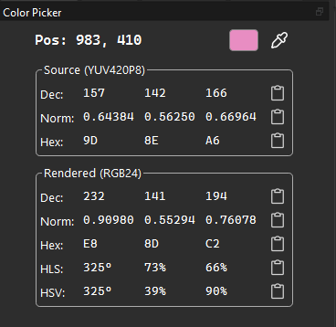
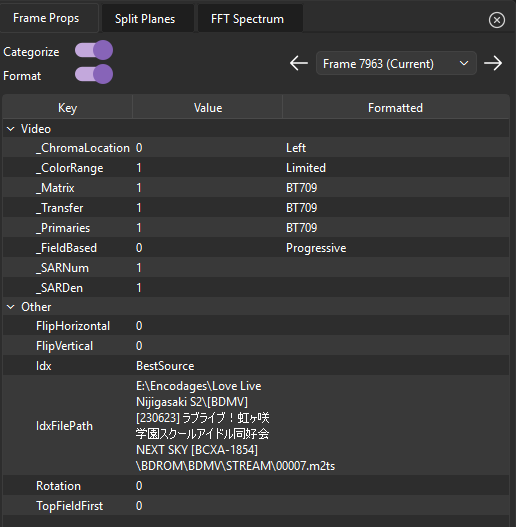
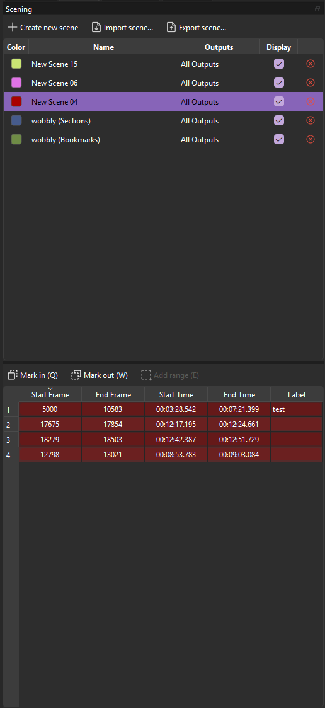
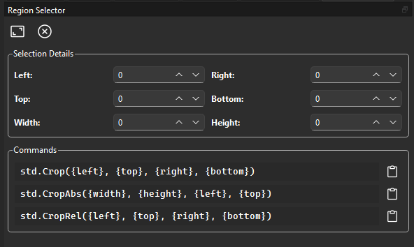

# First-Party Plugins

First-party plugins are official components integrated directly into the **VSView** source code and distributed with each release.

- :lucide-pipette: **Color Picker**

    ---

    Inspect precise pixel values directly from the viewport. View both rendered RGB and raw source values in real-time.

    [:lucide-move-right: Explore Color Picker](#color-picker)

- :lucide-list-video: **Frame Properties**

    ---

    Access frame properties attached by VapourSynth filters.

    [:lucide-move-right: Explore Frame Properties](#frame-properties)

- :lucide-clapperboard: **Scening**

    ---

    Create, manage, and export scene ranges. Supports custom parsers and serializers.

    [:lucide-move-right: Explore Scening](#scening)
    
- :lucide-scan: **Region Selector**

    ---

    Select and adjust precise regions in the viewport for cropping and inspection.

    [:lucide-move-right: Explore Region Selector](#region-selector)

---

## Color Picker

The Color Picker dock tool allows you to inspect precise pixel values at any position in the frame.

<figure markdown="span">
    { loading=lazy }
</figure>

### How to Use

1.  Click the **Pipette icon** in the toolbar to activate the tool.
2.  **Hover the mouse** over the viewport to see real-time pixel data.
3.  **Right-click** or click the tool icon again to deactivate.

### Data Provided
The inspector provides two sets of values for the selected pixel:

- **Rendered Values:** The RGB values as they appear after the internal **VSView** rendering pipeline.
- **Source Values:** The raw, underlying sample values directly from the VapourSynth clip.

---

## Frame Properties

The Frame Properties panel displays metadata attached to each frame by VapourSynth filters.

<figure markdown="span">
    { loading=lazy }
</figure>

### Features
- **Categorization:** Properties are grouped into logical categories (e.g., Video, Metrics, Field).
- **Formatters:** Values are automatically formatted into readable strings based on their type.
- **Context Menu:** Right-click a property to display a context menu with options to copy the property value or its key.

!!! Abstract "Extended Functionality"
    For additional property categories and formatters, see [FrameProps Extended](second-party.md#frameprops-extended).

---

## Scening

The Scening dock tool is designed for creating, managing, and exporting scene ranges.
<figure markdown="span">
    { loading=lazy }
</figure>

### Scene Management

The upper panel manages **scenes**, which are named containers for ranges. Each scene has a customizable color, can be bound to specific outputs, and has a display toggle to control timeline visibility.

- **:lucide-plus: Create new scene** adds a new scene.
- **:lucide-x: Delete** removes a scene.
- The **Color** swatch changes the scene's color.
- The **Outputs** column restricts a scene to specific video outputs.
- The **Display** checkbox toggles the scene's visibility on the timeline.

### Adding Ranges

The lower panel shows the ranges belonging to the selected scene. You can either build ranges using the **Mark in / Mark out** workflow, or add the current frame directly as a single-frame range.

Use the standard range workflow when you want a span:

1. Navigate to the desired start frame on the timeline.
2. Press ++q++ (or click **Mark in**) to set the start point.
3. Navigate to the desired end frame.
4. Press ++w++ (or click **Mark out**) to set the end point.
5. Press ++e++ (or click **Add range**) to commit the range to the selected scene.

Use the single-frame workflow when the range should start and end on the same frame:

1. Navigate to the desired frame on the timeline.
2. Press ++r++ (or click **Add frame**) to add that frame as a range to the selected scene.

Each range displays its **Start Frame**, **End Frame**, **Start Time**, **End Time**, and an optional **Label**.

### Keyboard Shortcuts

| Shortcut             | Action                           |
| :------------------- | :------------------------------- |
| ++q++                | Toggle range start (Mark in)     |
| ++w++                | Toggle range end (Mark out)      |
| ++e++                | Validate / add the pending range |
| ++r++                | Add the current frame as a range |
| ++del++              | Remove selected range or scene   |
| ++ctrl+left++        | Seek to previous range boundary  |
| ++ctrl+right++       | Seek to next range boundary      |
| ++ctrl+shift+left++  | Seek to previous range           |
| ++ctrl+shift+right++ | Seek to next range               |

Each shortcut is customizable in the **Settings** menu.

### Timeline Integration

When a scene's **Display** checkbox is enabled, its ranges are drawn as colored notches directly on the timeline.
Hovering over a notch displays a tooltip with the range label (if set).
Scenes can be filtered per output, so only relevant ranges are shown for the active video tab.

### Import & Export

The toolbar provides **Import scene...** and **Export scene...** buttons for working with external files.

#### Supported Import Formats

| Format                   | Extension      |
| :----------------------- | :------------- |
| Aegisub Advanced SSA     | `.ass`         |
| OGM Chapters             | `.txt`         |
| Matroska XML Chapters    | `.xml`         |
| XviD Log                 | `.txt`, `.log` |
| QP File                  | `.qp`, `.txt`  |
| Wobbly File              | `.wob`         |
| Python List (Frames)     | `.txt`         |
| Python List (Timestamps) | `.txt`         |

#### Supported Export Formats

| Format                   | Extension |
| :----------------------- | :-------- |
| OGM Chapters             | `.txt`    |
| QP File                  | `.qp`     |
| Python List (Frames)     | `.txt`    |
| Python List (Timestamps) | `.txt`    |

!!! Abstract "Extended Functionality"
    Developers can register custom parsers and serializers via the plugin hook system.
    See the [Scening Tool API](../api/developer/tools/scening.md) for details.

---

## Region Selector

The Region Selector tool defines rectangular regions within the frame, primarily for generating VapourSynth crop parameters.

<figure markdown="span">
    { loading=lazy }
</figure>

### Features

- **Boundary Adjustment:** Direct control over Left, Right, Top, Bottom, Width, and Height via spin boxes.
- **Snap to Modulo:** Selection boundaries snap to the `mod` value defined in settings (e.g., mod 2, mod 4).
- **Code Generation:** Generates VapourSynth snippets (e.g., `std.Crop`) based on the active selection.
- **Interactive Overlay:** Resizable and movable region overlay with corner/edge handles.

### How to Use

1.  Click the **Frame Corners** icon or press ++c++.
2.  **Left-click and drag** in the viewport to define the initial region.
3.  Adjust boundaries using the **handles** or **spin boxes**.
4.  Click the **Clipboard icon** to copy the generated code.
5.  Click the **X-Circle icon** or press ++c++ to deactivate.

### Keyboard Shortcuts

| Shortcut | Action                      |
| :------- | :-------------------------- |
| ++c++    | Toggle Region Selector tool |
| ++esc++  | Clear current selection     |

Shortcuts, mod and code snippets are configurable in the **Settings** menu.
